# DISPONIBILIDADE DE ESTOQUE

**Alice Cabral de Avelar Marques, alicecamarques@gmail.com**

**Ana Carolina Manso Silvério, carol.manso1@gmail.com**

**Juliana Silvestre da Silva, juliana.silvestresilva@hotmail.com**

**Marco Aurélio Silva de Souza Júnior, aureliojuniorcmrj@hotmail.com**

---

*Curso de Ciência da Computação, Unidade {Coração Eucarístico}*

*Instituto de Informática e Ciências Exatas – Pontifícia Universidade de Minas Gerais (PUC MINAS), Belo Horizonte – MG – Brasil*

---

***Resumo**. Para os empreendedores, é de extrema importância haver um bom gerenciamento de estoque, a fim de obter um melhor controle de seus produtos, da procura dos clientes e consequentemente, atender a demanda local, aumentar a qualidade e competitividade da empresa perante os concorrentes sucesso no mercado e uma melhor obtenção de lucros.Muitas empresas, principalmente as pequenas e microempresas, entretanto, não possuem um controle rígido em um ambiente com milhares de produtos estocados, e a gestão de estoque se torna algo complexo devido à diversidade de itens,o que dificulta a administração da classificação da importância de cada mercadoria.Com isso, as chances de não obterem o resultado esperado são grandes, pois passam a não atender a expectativa dos clientes,a perderem muitos produtos e obterem problemas. Diate ao exposto,esse projeto tem o objetivo de ajudar na automatização do processo de gerenciamento do estoque, por meio da criação de um software que realize a gestãode estoque para o empreendedor, de forma facilitada e integra, proporcionando dados compactados, relatórios eficientes e estratégias de qualidade com a tecnologia mais recente do mercado, a fim de aperfeiçoar a administração do comércio e garantir o sucessoda empresa. .*

---

**1. Introdução**

```
1.1 Contextualização 
```

Conforme o passar do tempo, é notável a importância em se debater sobre custos logísticos e gerenciamento de estoque, devido ao desejo de diversos cidadãos brasileiros de possuir o negócio próprio. Sem dúvidas, esse debate é fundamental e deve estar enraizado na origem do projeto, sendo o crescimento do plano empreendedor atualizado com as estratégias mais recentes. Desse modo, o objetivo principal de uma boa gestão, é otimizar o investimento financeiro da empresa, de tal forma que, ocorra a redução da necessidade do capital investimento. Diariamente, é evidente o aumento do uso de ferramentas que proporcionem à corporação o atributo de concorrência no mercado. Assim, a utilização correta do estoque de segurança ou de cobertura para atender a demanda local do usuário, é importante para manter o nível de atendimento, consequentemente, ocorrendo o aumento da qualidade e competitividade da empresa perante os concorrentes. Naturalmente, possuir um inventário e administrar as movimentações dos produtos, atribuindo estratégias de venda e controle, é, indubitavelmente, um diferencial no mercado varejista. A diferença entre empreendimentos que atingem o sucesso funcional do projeto e aqueles que fecham as portas, é, muitas vezes, resultado da administração e estratégias utilizadas pelo proprietário e equipe. Nesse sentido, em um ambiente com milhares de produtos estocados, onde é necessário manter um controle rígido, fazer a gestão de estoque se torna algo complexo devido à diversidade de itens, dificultando a administração da classificação da importância de cada mercadoria.

```
1.2 Problema 
```

De acordo com o evidenciado, o problema que se busca resolver com este projeto é o mau gerenciamento do estoque de micro e pequenas empresas, o qual gera alto investimento e baixa captação de novos clientes, por consequência, havendo taxas inconstantes de desperdício de produtos e alta taxa de investimento com retornos não eficientes.

```
1.3 Objetivo Geral 
```

A finalidade integrada nesse projeto é a criação de um software que realize a gestão de estoque para o empreendedor, de forma facilitada e integra, proporcionando dados compactados, relatórios eficientes e estratégias de qualidade com a tecnologia mais recente do mercado, a fim de aperfeiçoar a administração do comércio e garantir o sucesso financeiro da empresa.

```
	1.3.1 Objetivos Específicos 
```

Proporcionar funcionalidades que viabilizem ao dono da empresa administrar seu próprio negócio por meio da gestão de estoque e ter em seu alcance relatórios atualizados a todo momento a partir das informações inseridas. * Garantir ao usuário, a partir das informações inseridas, a opção de utilizar gratuitamente as estratégias atualizadas de mercado disponibilizadas em nosso software. * Permitir a interação do usuário com a equipe de desenvolvimento para adicionar funcionalidades e relatórios específicos necessários para seu negócio.

```
1.4 Justificativa 
```

De acordo com a pesquisa realizada pelo Sebrae, chamada “Causa Mortis”: a falta de gestão é uma das principais causas de mortalidade de empresas no Brasil. Essa pesquisa evidencia como são essenciais a organização e controle de um negócio, sendo um grande erro não se preocupar com o assunto, já que a falta de eficiência e organização ao gerenciar o estoque pode gerar prejuízos importantes para o negócio, como por exemplo: perda de vendas e investimentos desnecessários em produtos e materiais.

```
	1.4.1 Questionário realizado
```

As seguintes perguntas foram elaboradas com o objetivo de adquirir um maior embasamento sobre o contexto do projeto, assim, possibilitando o desenvolvimento do produto com maior exatidão sobre as reais necessidades dos usuários. Além disso, com a análise das perguntas foi possível comprovar a necessidade da elaboração do produto no mercado atual.

Por fim, as entrevistas foram realizadas diretamente com os proprietários da empresas com a finalidade de se obter as informações com a maior veracidade possível, sendo eles possíveis usuários do software em estado de aperfeiçoamento.

| Perguntas | Entrevistado 1 | Entrevistado 2 |
|:-:|:-:|:-:|
| Quais são os objetivos do seu negócio? | Investimento ao longo prazo, sonho em possuir um negócio bom. | Uma nova aventura, o usuário tem interesse e gosto por bebidas alcoólicas. |
| O que é necessário para gerenciar seu negócio? (organização, delegar tarefas, habilidade de venda, promover ajustes no preço) | Gerenciar o estoque, organização de produtos, comprar os produtos de um fornecedor barato e com qualidade, divulgar nas redes sociais, lançamento de novos produtos, gerenciar os custos (curva ABC). | Controle de estoque atualizado diariamente devido a alta movimentação de produtos e venda. |
| Quais são as necessidades do seu negócio?  (alto estoque, compra prévia de produtos e promoções mensais) | Faturamento mensal, marketing (Instagram, Whatsapp, Facebook). | Baixa quantidade de produtos em estoque, estoque com caráter popular. |
| Quais aplicações/software você usa? Essas aplicações são caras? | Software Alterdata, 260$. | Fantastsoft, não lembrou, porém falou que em outro momento compartilharia a informação. |
| Como funciona a divisão de encargos no seu negócio/software? | Separação de perfis: Administrador e usuário. Obs --> usuário= sem relatórios credenciais. | Computador 1 - Caixa 1 (funções básicas) Computador 2 - Caixa 2 (funções básicas) Computador 3 - Administrador (computador em sala administrativa). |
| Você tem dificuldade em encontrar seu produto? | Não, fornecedores de fácil acesso (Friboi, Coca-Cola, Heineken...). | Em algumas ocasiões foi relatado, pelo dono da empresa, problemas relacionado ao fornecimento de alguns produtos comercializados de origem artesanal e algumas dificuldades em solicitar os produtos da marca Heineken. |
| A distância do seu fornecedor é alta? | Depende, máximo 3 dias de acordo com o relato. | Sim, algumas requisições, infelizmente, chegam a demorar uma semana dependendo da época do ano. Entre eles estão a Ambev, Coca Cola, Elma Chips e Heineken. |
| Como você lida com o desperdício? | Transforma o alimento ou o utiliza como alimento (Possui 5 familiares). | Os produtos são utilizados pelo proprietário diariamente quando há iminência de desperdício ou são realizadas festas com o objetivo de consumi-los. Observação --> Durante o período de armazenamento de grandes quantidades no estoque, houve vencimento dos produtos, sendo eles dispensados. |
| Você utiliza de métodos ou estratégias de expansão da sua empresa? | Divulgação no Instagram, Facebook e Whatsapp. Já foram realizados anúncios no instagram, mas sem sucesso. | Dificilmente é utilizado algum método, porém já foram utilizados anúncios (não informou plataforma). |
| Quais dificuldades você enfrenta diariamente com seu negócio e gestão de estoque? | Nunca se sabe o que especificamente vai vender, gestão de estoque é fácil pois possui poucos produtos, porém a organização é feita diversas vezes manualmente, exemplo: checar validade ( sistema confuso, mas apresenta a funcionalidade de acordo com o dono ) | O espaço foi relatado como a primeira dificuldade, pois além de funcionar como fornecedor, trabalha também como bar. Em segundo lugar, a organização interna do estabelecimento não é boa, não há a separação dos produtos por categoria e lugar. O terceiro problema é em relação ao uso da tecnologia, dono não é muito apto aos novos métodos, assim, os funcionários e ele utilizam soluções manuais e antiquadas. |
| Como você lida com a concorrência? | O proprietário realiza a pesquisa por meio da busca dos produtos e preços via telefone para se adequar ao mercado. | É feito uma pesquisa em volta da localidade do estabelecimento sobre preços e produtos, também, é efetivado a procura por estabelecimentos que possam agregar valor na redondeza, muitas vezes, abastecendo os estoques vizinhos. O abastecimento não é constante, havendo demanda diferentes. A frequência que isso ocorre não é certa, porém essas informações são armazenadas. O dono não possuía em mãos no momento. |

```
1.5 Público Alvo
```

Em primeiro lugar, posto que todos os negócios possam se beneficiar do serviço de gestão de estoque disponibilizado pela empresa MPSYS, o foco do projeto está no público que possuem seu próprio negócio e geralmente possuem presença ou participação ativa no serviço oferecido, organizando o volume de estoque, realizando transações com o fornecedor e promovendo promoções, quando necessário, por exemplo.

Em segundo lugar, o público-alvo estabelecido para esta solução são os homens e mulheres entre 35-60 anos que se encontram trabalhando em seu próprio negócio, constantemente, procurando meios para realizar uma melhor gestão do seu serviço e aumentar seu lucro. Geralmente, os donos das empresas possuem formação no ensino superior, sendo a área selecionada não vinculada com sua negócio.

Por fim, por enquanto, a equipe tem como foco os empreendedores na cidade Belo Horizonte durante o processo de desenvolvimento e testes da aplicação do projeto. Ademais, como requisito fundamental para utilizar o produto desenvolvido, o público deve possuir o hábito de usar computadores e dispositivos móveis para atualização de dados no sistema,assim, realizando a gestão de estoque, empresa e possuindo acesso às ferramentas empreendedoras disponibilizadas no software.

**2. Especificação do Projeto**

Em vista que, o problema enfrentado está presente no cotidiano do público-alvo, os pontos mais relevantes a serem tratados neste projeto foram fortificados por meio de pesquisas. Essa apuração foi realizada em campo pelo integrante João, com o auxílio do grupo para análise do questionário. Além disso, foi levado em consideração o modo como o usuário se comportou em seu local de trabalho durante a entrevista, sendo que as informações adquiridas durante esse processo foram de grande importância para aprimorar o esquema já desenvolvido. Diante disso, os dados obtidos durante a realização do método de pesquisa foram armazenados em forma de personas e histórias de usuários.

*OBS: Os dados adquiridos e transformados em personas foram baseados fielmente no perfil traçado pela pesquisa realizada em campo.*

```
2.1 Personas
```

A organização das informações selecionadas durante o desenvolvimento e entendimento das personas estão nas figuras abaixo:

|                          | Pedro Teixeira                                                                                       |                                                                      |
|-----------------------------------------------------------------------|------------------------------------------------------------------------------------------------------|----------------------------------------------------------------------|
|                                                                       | Idade: 34 Ocupação: Veterinário, é dono de um pequeno açougue que atua como mini-restaurante e bar.  | Aplicativos: Instagram  Conta Azul  Facebook                         |
| Motivações: Loja e Família  Amor por carne  Viajar                    | Frustrações: Poucos clientes, Roubo, Fornecedores caros, Sistema de Venda                            | Hobbies, História: Robótica, Veio de Brasília                        |
|                          | Clara Pereira                                                                                        |                                                                      |
|                                                                       | Idade: 56 Ocupação: Engenheira química, dona de uma distribuidora de bebidas                         | Aplicativos: Instagram  Zé Delivery                                  |
| Motivações: Financeira  Gosta de cerveja  Moradia perto do trabalho   | Frustrações: Pessoas inconvenientes  Venda Fiado sem pagamento  Alto custo do fornecedor             | Hobbies, História: Pescaria  Churrasco                               |
|                          | Rodolfo Lima Antunes                                                                                 |                                                                      |
|                                                                       | Idade: 23 Ocupação: Dono de uma microempresa emergente de móveis planejados.                         | Aplicativos: Instagram  REHAU  IVegan                                |
| Motivações Financeira  Amor pela culinária vegana  Avanço tecnológico | Frustrações Perda de matérias primas  Ser tratado como leigo  Reuniões longas                        | Hobbies, História Cozinhar para os amigos e a namorada  Jogar dota 2 |
|                          | Raquel Ferreira                                                                                      |                                                                      |
|                                                                       | Idade: 36 Ocupação: Dona de uma empresa de cosméticos.                                               | Aplicativos: Instagram  Pinterest  Facebook                          |
| Motivações Crescimento da área estética  Viagens                      | Frustrações Excesso de algumas mercadorias  Perda de mercadoria por estar vencida                    | Hobbies, História Viajar  Sair com as amigas                         |
|                          | Renato Hickmann                                                                                      |                                                                      |
|                                                                       | Idade: 48 Ocupação: Dono de uma pequena empresa de sapatos.                                          | Aplicativos: Instagram  Airbnb  Facebook                             |
| Motivações Financeira  Viagens  Ter a empresa como marca reconhecida  | Frustrações Conversas curtas  Perda de mercadoria por estar fora de moda   Perguntas mal respondidas | Hobbies, História Viajar  Jogar Cs:go com seus filhos                |
|                          | Andrea Camargos                                                                                      |                                                                      |
|                                                                       | Idade: 60 Ocupação: Dona de uma Farmácia                                                             | Aplicativos: Instagram  Facebook  Ifood                              |
| Motivações Família  Saúde                                             | Frustrações Fornecedores com altos preços    Dificuldade em encontrar produto no estoque             | Hobbies, História Academia  Passar o tempo com os netos              |

```
2.2 Histórias de Usuários
```

A partir da compreensão do dia a dia das personas identificadas para o projeto, foram registradas as seguintes histórias de usuários.

| Eu como …  [PERSONA] | … quero/desejo … [O QUE] | … para .... [POR QUE] |
|:-:|:-:|:-:|
| Pedro Teixeira | Além de aumentar as vendas realizadas, expandir o comércio e realizar eventos de churrasco no bairro. | Construir uma amizade com base sólida no bairro para proporcionar um lazer mais agradável para sua família. |
| Clara Pereira | Realizar o máximo de vendas possível. | Poder viajar com mais frequência e não precisa monitorar o trabalho diariamente. |
| Rodolfo Lima Antunes | Manter um registro dos produtos mais vendidos. | Evitar a perda de matéria primas . |
| Raquel Ferreira  | Manter registro da quantidade e validade dos produtos. | Vender os lotes mais antigos fazendo promoções e aumentar as vendas sem  prejuízo.  |
| Renato Hickmann | Dados com o número de vendas mensal de cada produto. | Realizar uma pesquisa de tendência de mercado com os dados fornecidos. |
| Andréa Camargos | Obter registro e comparação dos preços de fornecedores. | Poder ajudar pessoas que necessitam de remédios e não possuem condições de comprar pelo valor original. |

**3. Projeto da Solução**

É necessário coletar os requisitos do projeto para atingir os objetivos,o processo inclui definir e documentar as necessidades das partes interessadas.

O escopo funcional do projeto é definido por meio dos requisitos funcionais que descrevem as possibilidades interação dos usuários, bem como os requisitos não funcionais que descrevem os aspectos que o sistema deverá apresentar de maneira geral. Estes requisitos são apresentados a seguir.

```
3.1 Requisitos funcionais
```

A tabela a seguir apresenta os requisitos do projeto, identificando a prioridade em que os mesmos devem ser entregues.

| No.           | Descrição                       | Prioridade |
| ------------- |:-------------------------------:| ----------:|
|RF-01		|O site deve conter na página principal um menu com opções de ações de usuário. | Alta |     
|RF-02		|O site deve permitir o cadastro de usuários.  | Alta |
|RF-03		|O usuário deve conseguir cadastrar produtos no estoque.|  Alta   |           
|RF-04		|O usuário deve conseguir consultar a quantidade de determinado produto no estoque.| Alta   |
|RF-05		|O usuário deve conseguir atualizar dados um produto previamente cadastrado.| Alta   |            
|RF-06		|O usuário deve conseguir deletar um produto cadastrado. | Alta     |           
|RF-07		|O site deve fornecer uma lista com todos os produtos cadastrados. | Alta   |
|RF-08   	|O site deve oferecer uma funcionalidade de gráficos dinâmicos sobre as vendas.  |  Média   |
|RF-09		|O site deve alertar sobre baixa quantidade de determinado produto no estoque.   |  Média   |
|RF-10		|O site deve fazer o autopreenchimento nos filtros de busca e de cadastro de produtos.| Média |
|RF-11  	|O site deve fornecer informações de contato dos desenvolvedores da página.     |  Baixa    |

```
3.2 Requisitos não funcionais
```

A tabela a seguir apresenta os requisitos não funcionais que o projeto deverá atender.

| No.           | Descrição                       | Prioridade |
| ------------- |:-------------------------------:| ----------:|
|RNF-01		|O site deve ser publicado em um ambiente acessível publicamente na Internet (Repl.it, GitHub Pages, Heroku). | Alta |     
|RNF-02		|O site deverá ser responsivo permitindo a visualização em um celular de forma adequada.  | Alta |
|RNF-03		|O site deve ter bom nível de contraste entre os elementos da tela em conformidade.|  Média   |           
|RNF-04		|O site deve ser compatível com os principais navegadores do mercado (Google Chrome, Firefox, Microsoft Edge)| Alta   |
       


```
3.3 Restrições
```

As questões que limitam a execução desse projeto e que se configuram como obrigações claras para o desenvolvimento do projeto em questão são apresentadas na tabela a seguir.

| No.           | Descrição                       |
| ------------- |:-------------------------------:|
|RE-01		|O projeto deverá ser entregue no final do semestre letivo, não podendo extrapolar a data de 07/07/2020. |
|RE-02		|O aplicativo deve se restringir às tecnologias básicas da Web no Frontend.  |
|RE-03		|A equipe não pode subcontratar o desenvolvimento do trabalho. |          

```
3.4 Tecnologias
```

A solução é acessada através de um navegador à escolha do usuário, para visualização da página web, implementada com arquivos Java, JavaScript, HTML, CSS, PostgreSQL e imagens, que, por sua vez, serão hospedadas no GitHub Pages.

A publicação no site é feita por meio de uma submissão do projeto (push) via git para o repositório remoto no [GitHub](https://github.com/icei-pucminas/ti2-cc-disponibilidade-de-estoque).

Os artefatos do projeto são desenvolvidos a partir de diversas plataformas e a relação dos ambientes com seu respectivo propósito é apresentada na tabela que se segue.

| Ambiente                        | Plataforma / Link de Acesso                                                                           |
| --------------------------------|:-----------------------------------------------------------------------------------------------------:|
| Repositório de código fonte     | [GitHub](https://github.com/icei-pucminas/ti2-cc-disponibilidade-de-estoque/tree/master/codigo)       |
| Documentos do projeto           | [GitHub](https://github.com/icei-pucminas/ti2-cc-disponibilidade-de-estoque/tree/master/documentacao) |
| Gerenciamento do Projeto        | [Trello](https://trello.com/b/bfvSbq8m/ti2)                                                           |
| IDE de Desenvolvimento          | Eclipse                                                                                               |
| Gerenciamento de Dependências   | Maven                                                                                                 |
| Gerenciamento de banco de dados | phpPgAdmin / pgAdmin 4                                                                                |
| Web Framework                   | Spark Framework                                                                                       |

Com relação à gestão do código fonte, o grupo utiliza um processo baseado no GitHub Flow criado pelo próprio GitHub (atualizado em 24/07/2020), mostrado na Figura a seguir. Portanto, o projeto segue a seguinte convenção para o nome de branchs:

- master: versão pronta para implementação (deploy).
- nome-explicativo: versão herdada da master.


```
3.4. Serviços inteligentes
```

O mecanismo de inteligência utilizado no sistema será um chatbot. Para isso, o chatbot em questão será programado de modo a simular a conversação de um ser humano, utilizando conhecimento externo como base para suas respostas, assim terá como objetivo auxiliar o usuário do site, fornecendo informações sobre como utilizar os diversos serviços oferecidos. 

A tabela a seguir apresenta os requisitos funcionais do chatbot, identificando a prioridade em que os mesmos devem ser entregues.

| No.           | Descrição                       | Prioridade |
| ------------- |:-------------------------------:| ----------:|
|RF-01		|O chatbot deve ser capaz de reconhecer o objetivo específico ou ideia que o usuário deseja transmitir em uma mensagem | Alta |     
|RF-02		|O chatbot deve fornecer uma respota clara utliziando uma base de conhecimento.  | Alta |
|RF-03		|O chatbot deve ser capaz de esclarecer informações sobre o funcionamento do site |  Alta   |           
|RF-04		|O chatbot deve fornecer informações sobre como cadastrar, atualizar ou excluir um produto| Alta   |
|RF-05		|O chatbot deve fornecer informações sobre como gerar um relatório no site| Alta   |            
|RF-06		|O chatbot deve fornecer informações sobre os desenvolvedores, além de um meio para contatá-los. | Média     |  

Dessa forma, com base nos requisitos definidos acima o chatbot implementado no site será desenvolvido com auxílio da ferramenta da IBM Watson Assistant. Foram criadas as seguintes intenções:
 - #bem-vindo: para ativar saudações iniciais ou voltar ao início da conversação, 
 - #curiosidades: para dar dicas sobre gerenciamento de estoques, 
 - #funcionalidades: para instruir sobre funções do site e,
 - #encerramento: para encerrar a conversa.
 
Foram criadas, ainda, as entidades “funcionário”, “produto” e “fornecedor”, agrupadas em “entidade”, e “consultar”, “remover”, “alterar” e “incluir”, agrupadas em “operação”. O chatbot se inicia com uma saudação e logo pergunta se o usuário deseja ler uma dica ou ser orientado sobre alguma funcionalidade. Uma das duas opções poderá ser clicada ou pode-se digitar livremente sobre sua intenção. Caso o bot identifique a intenção “curiosidades”, ele apresentará uma de 7 mensagens informativas aleatoriamente e em seguida perguntará se o usuário deseja algo mais. Em caso de resposta afirmativa, o bot ativará a intenção “bem-vindo” que irá redirecionar a conversa para o início. Em caso de negativa, será feita uma despedida. Na identificação da intenção “funcionalidades”, o bot perguntará se deseja realizar uma operação com as entidades “funcionário”, “produto” ou “fornecedor”, a seguir perguntará qual tipo de operação deseja-se fazer, dentre “consultar”, “remover”, “alterar” e “incluir”. Em cada combinação de respostas, o chatbot apresentará uma mensagem informativa, de modo a conduzir o usuário até o local no site. Após cada interação, o bot perguntará se deseja algo mais, até que se encerre o ciclo.

```
	3.4.1 IS Canvas
```
Para a implementação do chatbot, a equipe elaborou o quadro IS Canvas, com o objetivo de facilitar o planejamento e a visualização do projeto. 

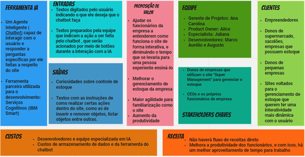

```
	3.4.2 Jornada do Usuário
```

A jornada do usuário é o ponto de partida do design de diálogo. Ela exibe os passos que se espera que o usuário execute para alcançar seu objetivo. Dessa forma, o chatbot desenvolvido configura-se como um Keyword Recognition Chatbots, ou seja, reconhecedores de palavra-chave, visto que tem como objetivo capturar o que o usuário digita e responder apropriadamente, uma vez que as palavras chaves e as intenções sejam identificadas.

O chatbot em questão visa ajudar o usuário a ter uma melhor experiência no site, sendo capaz de responder a dúvidas como “Como inserir um produto? Como cadastrar um novo funcionário? Como alterar a ocupação de um funcionário?” e, além disso, pode fornecer curiosidades sobre o gerenciamento de estoque. A interação com esse agente inteligente se inicia com uma introdução, na qual há a apresentação do chatbot como um assistente e um menu em que o usuário pode escolher se deseja obter curiosidades sobre o gerenciamento de estoque ou esclarecer dúvidas sobre uma funcionalidade do site. Caso escolha a segunda opção, logo que o usuário enviar uma pergunta para o chatbot, este identifica a intenção a entidade presentes na mensagem e fornece ao usuário uma resposta compatível. Por fim, o usuário deve confirmar se sua dúvida foi esclarecida e se deseja fazer mais perguntas. Caso possua mais perguntas, o processo se reinicia, caso contrário é exibida uma mensagem de despedida.

Tendo em vista o processo descrito acima, segue uma lista de tarefas que o usuário precisa cumprir para atingir seu objetivo.
	1. Usuário escolhe entre obter curiosidades ou esclarecer dúvidas a respeito das funcionalidades do site.
	2. Caso escolha a primeira opção, depois de obter as curiosidades, o usuário informa se deseja esclarecer dúvidas acerca das funcionalidades do site. 
	3. Caso escolha a segunda opção, o usuário pergunta ao chatbot acerca de uma das funcionalidades do site.
	4. Usuário informa se há mais alguma dúvida.
	
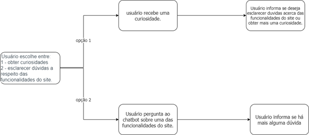

```
	3.4.3 Fluxo de Diálogo
```

A partir da elaboração da jornada de usuário torna-se possível a elaboração de um fluxo de diálogo, de modo que, uma vez que as intenções e entidades são identificadas, o chatbot irá retornar uma mensagem compatível. Dessa forma, é estabelecido o fluxo da conversa entre o chatbot e o usuário. Para que o chatbot retorne ao usuário uma mensagem compatível com a expectativa do usuário, foram estabelecidas intenções e entidades. Sendo assim, o agente inteligente deve ser capaz de reconhecer intenções como: usuário com dúvida, usuário sem dúvida, cadastrar, atualizar, consultar ou remover funcionário, produto e fornecedor. Tais intenções são obtidas a partir das mensagens enviadas pelo usuário e, em conjunto com as entidades produto, funcionário e fornecedor, auxiliam no direcionamento do fluxo do diálogo.

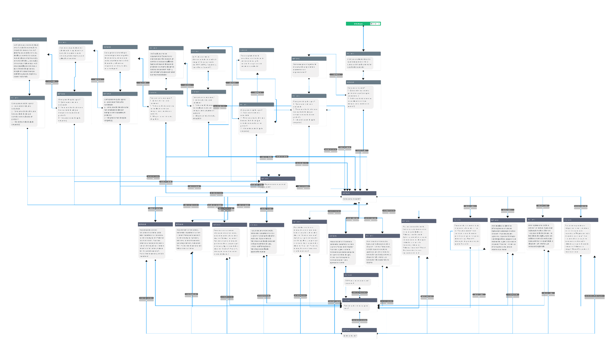

```
3.5. Modelagem de dados
```

Para a modelagem de dados, os integrantes do grupo fizeram a descrição do minimundo que envolve um sacolão, visto que houve a especificação de um tipo de estabelecimento para  esse projeto. Dessa forma: 

- Um sacolão é determinado por seu CNPJ, além disso possui nome, um email a ele relacionado, uma senha para entrar no sistema.
- Um sacolão possui N funcionários, sendo esses identificados por um código único, nome, cargo e salário.
- Um sacolão pode emitir N notas fiscais, sendo que cada uma delas é identificada por seu número de nota fiscal, valor total e data de emissão.
- As notas fiscais por sua vez possuem um ou mais itens, cada item possui uma descrição e a quantidade de produtos e refere-se a um lote de produto.
- Os lotes dos produtos por sua vez são identificados por meio de um código único, descrição do lote, valor total do lote, data de validade, data de fabricação, valor unitário, quantidade disponível no estoque e categoria.
- Cada lote possui um fornecedor, sendo este identificado por meio de um código único e nome.
```
3.5.1 Modelo Entidade-relacionamento
```

Com base na descrição anteriormente apresentada, desenvolveu-se um diagrama Entidade-relacionamento para representar os dados do minimundo e a relação entre eles.


```
3.5.2 Modelo Relacional
```
Após desenvolver o modelo entidade- relacionamento, para realizar uma melhor visualização de dados, mais próxima ao que seria nas tabelas do SGBD, o grupo desenvolveu o modelo relacional dos dados, como mostrado a seguir. 


Nesse modelo, há as tabelas do banco de dados com seus respectivos, dados e tipos de dados. Vale ressaltar que o dado que possui uma chave amarela é tido como a chave primjária, e dado que possui um losango vermelho seria uma chave estrangeira. 
```
3.5.3 Aplicação prática dos modelos 
```
Para a aplicação e armazenamento do banco de dados, que foi projetado de acordo com o exposto, o grupo utilizou o SGBD PostgreSQL e para gerenciá-lo, o grupo utilizou o phpgAdmin.


> PostgreSQL 


> Exemplo da interface do phpgAdmin para admninistrar o banco de dados


Nessa plataforma, foi criado o banco de dados "controle de estoque" com suas respectivas tabelas, linhas e colunas. Para fazermos a conexão do banco de dados com o site, foi utilizado o backend feito em Java e o Apache Spark aplicado em projeto Maven no Eclipse, que possui ferramentas para trabalhar com base de dados e SQL, para fazer as rotas de conexão. Assim, o usuário do site digita  as informações que deseja cadastrar ou verificar nos formulário, e, por meio das requisições HTTP e queries , conseguimos  anexar os dados passados no nosso banco. O código está disponível na pasta "código". 


>Conexão do Banco de Dados ao site por meio do backend 

Até o momento, o grupo fez o cadastro de lotes de produtos no banco de dados, a conexão do login com o Banco de dados, e o código para cadastro de sacolão/usuário, sendo que esse último precisa de alguns ajustes para funcionar corretamente. As perspectivas futuras são de fazer o cadastro de funcionários, de fornecedores, consulta e venda dos produtos da mesma forma em que fizemos até o momento. 
A seguir, há o exemplo do cadastro de um lote de produtos, no caso, de morangos. 


>Cadastro de um lote de morangos


>Cadastro de um lote de morangos no banco de dados
```
3.5.3 Aplicação prática dos modelos- Banco de dados na nuvem 
```
Após o grupo obter sucesso com os testes e conexão com o Postgresql hospedado em localhost nas operações de inserção, remoção, atualização e listagem,  com visualização por meio do PhpgAdmin, foi aberta a discussão de que seria mais conveniente hospedar o banco de dados em nuvem, visto que tal ação daria acesso à vários usuários e desenvolveres a um só servidor, sem a necessidade de cada pessoa ter que configurar seu próprio banco de dados em sua máquina para fazer testes e ter acesso aos dados. Com isso, a plataforma de armazenamento do SGBD tornou-se um servidor oferecido pela Microsoft Azure, e o novo administrador de banco de dados tornou-se o PgAdmin, que faz conexão com servidores desse tipo e SGBDs armazenados em nuvem.

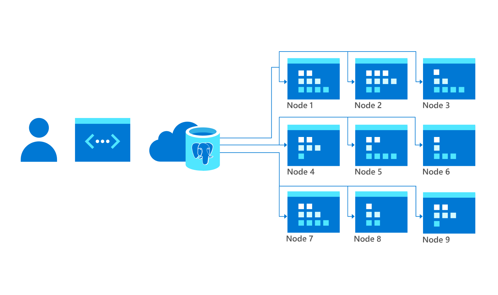
>Banco de dados em nuvem- Azure+PgAdmin

Dessa forma, houve uma mudança da conexão com o banco de dados no código, e as rotas continuaram as mesmas, visto que as tabelas, linhas e colunas são as mesmas do banco de dados em localhost. Nesse contexto, o usário, por meio de requisições HTTP, consegue fazer mudanças no banco de dados. A seguir, temos um exemplo de cadastro de um funcionário feito por meio do envio de uma requisição HTTP resultante do formulário com os seus dados, que irá gerar uma rota que por meio dos códigos em Java, irá executar os comandos e querys em SQL necessárias para adicionar as informações no banco de dados. Tal código está disponível na pasta "código" desse repositório.

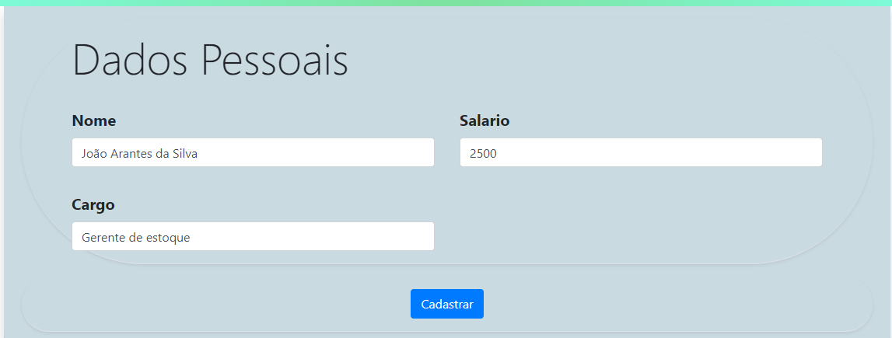
>Informações do cadastro de um novo funcionário

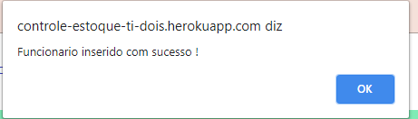
>Mensagem-cadastro de funcionário ocorrido com sucesso

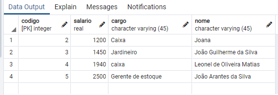
>Funcionário cadastrado no Postgresql

Além disso, a conexão com o banco de dados em nuvem permitiu a hospedagem do site também em nuvem por meio do heroku app e o funcionamento correto da conexão entre o site e o SGBD. Portanto, o site está hospedado em [Heroku-site](https://controle-estoque-ti-dois.herokuapp.com/), e nele, os usuários cadastrados podem modificar o banco de dados de sua empresa, assim como todos os desenvoolvedores podem ter acesso ao Postgresql, evitando divergências, erros e economizando tempo e memória computacional que gastariam ao fazer o seu próprio banco de dados em localhost. 


**4. Sistema desenvolvido**

```
4.1 Projeto de Interface
```

Um dos focos do projeto é propor um sistema intuitivo de operação mais fácil para o usuário que as soluções já existentes no mercado. Sendo assim, após passar pelo login, o sistema possui um cabeçalho padronizado, presente em todas as telas do sistema, no qual se pode realizar um acesso rápido, em menos de três cliques, a todas as funcionalidades disponibilizadas.

```
4.1.2 Fluxo do Usuário
```

A figura 1 expõe o diagrama de fluxo do usuário. Cada uma das telas será exibida na próxima seção - Wireframes. Para visualizar o wireframe interativo, acesse o [ambiente MarvelApp do projeto](https://marvelapp.com/23j0g346).

```
4.1.3 Wireframes, Telas e Funcionalidades
```

Nesta seção, as telas do sistema serão esmiuçadas a fim de oferecer esclarecimento ao usuário. A estrutura padrão é exibida na figura 2, a qual é dividida em 4 blocos. São eles:

- **Logo -** utilizado como âncora para voltar à tela inicial de acesso rápido;
- **Barra de navegação rápida -** contém links para as diversas funcionalidades do sistema;
- **Perfil de usuário** - apresenta o perfil em que o usuário está logado.
- **Conteúdo: Área de trabalho do sistema.**

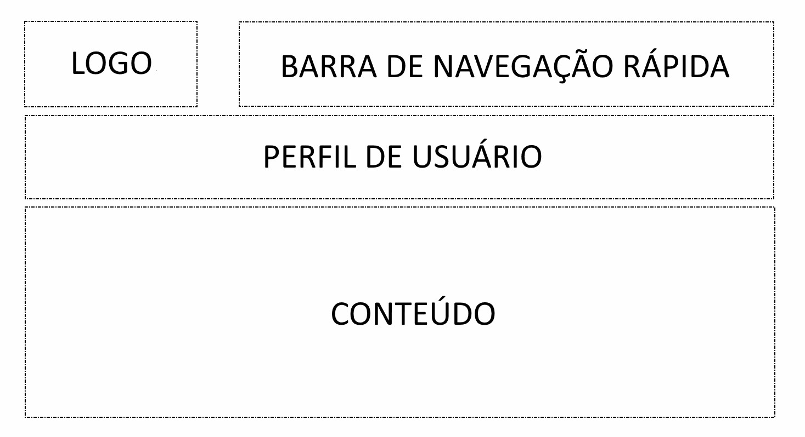

Figura 2 - Estrutura padrão do sistema

As telas que se seguem podem ser visualizadas interativamente por meio do MarvelApp, pela seguinte URL: [https://marvelapp.com/23j0g346/](https://marvelapp.com/23j0g346/) .

```
4.1.4 Tela - Home
```

A tela inicial foge ligeiramente da estrutura padrão mostrada anteriormente a fim de tornar o site mais chamativo (figura 3).

A página é composta por um cabeçalho com informações de contato, uma barra de navegação rápida onde se pode acessar o sistema por meio do link *“Entrar”*. O bloco de conteúdo apresenta destaques atuais da empresa, como promoções ou notícias.

No presente momento, apenas o link “*Entrar”* encontra-se disponível.


Figura 3 - Tela Inicial

```
4.1.5 Tela - Login
```

A tela de login (figura 4), exige inserção de campo de e-mail e senha para acesso ao sistema. Caso o usuário não seja cadastrado, deverá clicar em “*faça o cadastro agora”*.

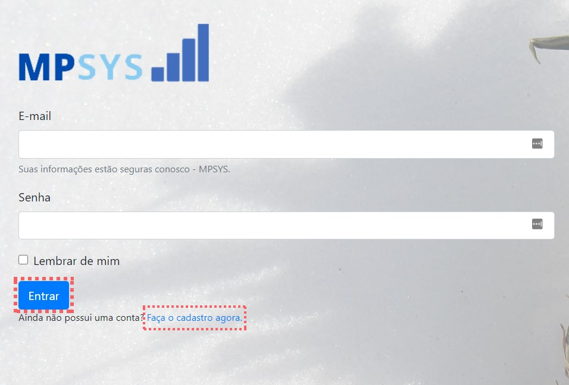

Figura 4 - Tela de Login

```
4.1.6 Tela - Cadastro de Usuário
```

Caso seja um novo usuário, deverá obrigatoriamente passar pela tela de cadastro de usuário (figura 5). Deverão ser informados os dados pessoais e empresariais, bem como a criação de uma senha de acesso.

Após isso, você será levado de volta para a tela de Login (figura 4) para confirmação de seu login.

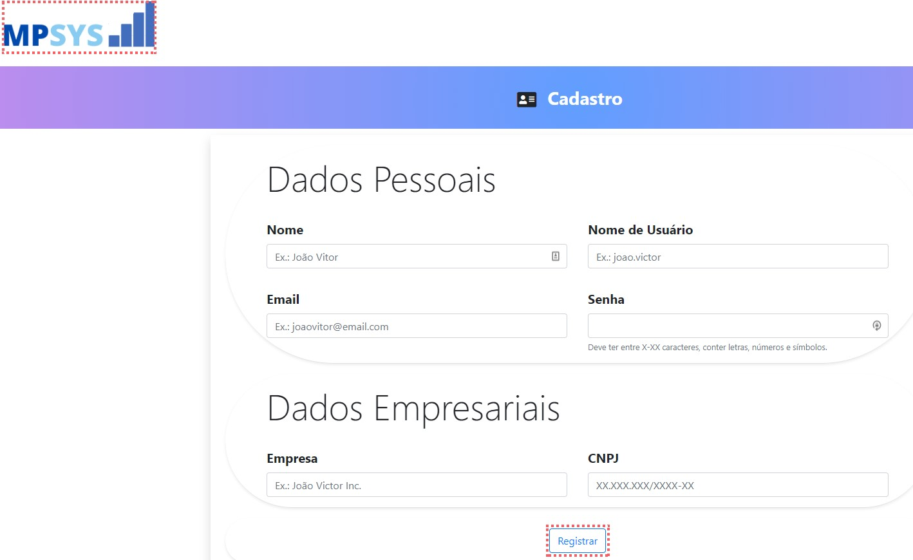

Figura 5 - Cadastro de Usuário

```
4.1.7 Tela - Acesso Rápido
```

A tela de acesso rápido é composta pelo logo do sistema(que ao clicar leva para esta tela), um menu de navegação rápida, uma área de exibição dos dados do usuário logado, e uma home com funcionalidades para acesso rápido e relevante de informações. Na Navbar, marcada pelo marcador roxo na imagem abaixo, apenas o *dropdown* Produtos e as Opções estão com funcionalidades, onde está marcado com a cor verde.


Figura 6.1 - Acesso Rápido

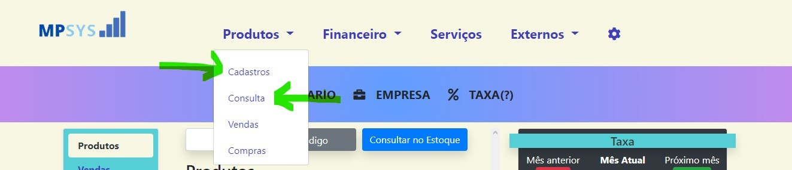

Figura 6.2 - Navbar Produtos


Figura 6.3 - Navbar Opções

Na figura 6.1, pode se visualizar três partes, mas que no final, são duas separadas. Em amarelo, se encontra as abas de acesso Rápido e Relevante (RapRel) que tem como objetivo proporcionar opções de funcionalidades que vão direto ao ponto e facilitem o acesso rápido de informações. Nessa entrega, apenas a aba “Produtos” está totalmente funcional, funcionando como acesso rápido aos produtos cadastrados e suas informações mais importantes, assim como uma pesquisa rápida por um produto específico, seja por código ou por descrição do mesmo.

Já o que está rodeado pelo marcador vermelho, é uma estrutura vazia de interatividade JavaScript, mas que está pronta para a implementação de um sistema que permita dar ao usuário informações relevantes sobre sua situação financeira no mês atual, como foi no mês passado, e como seria o crescimento ideal para o próximo mês. Essas funcionalidades serão implementadas junto com as funcionalidades sobre financeiro e relatórios. Abaixo dessas informações, se encontra uma tabela que será utilizada para projetar outros dados que sejam de interesse financeiro para o usuário.

```
4.1.8 Tela - Cadastro de Materiais
```

Nesta tela, será solicitado ao operador do sistema que insira a descrição, código, categoria, quantidade, valor de aquisição do material adquirido e localização a ser armazenado. Poderão ser modificados ou adicionados novos campos futuramente de acordo com as necessidades de cada empresa. Ao clicar em “*adicionar ao estoque”* o material será cadastrado localmente no dispositivo, em formato JSON, por meio do *localStorage*.

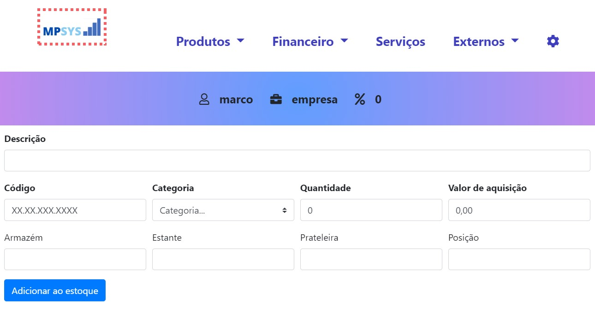

Figura 7 - Cadastro de Materiais

```
4.1.9 Tela - Consulta de Estoque
```

Nesta tela (figura 8), o operador deverá inserir os parâmetros de pesquisa e clicar em “*Consultar no Estoque”*. Será apresentado o resultado da pesquisa logo abaixo. O usuário poderá clicar em “*+ detalhes”* para exibir a tela contida na figura 9. Planeja-se implementar uma função onde poderá adicionar o item à “lista de reabastecimento” por meio desta tela.

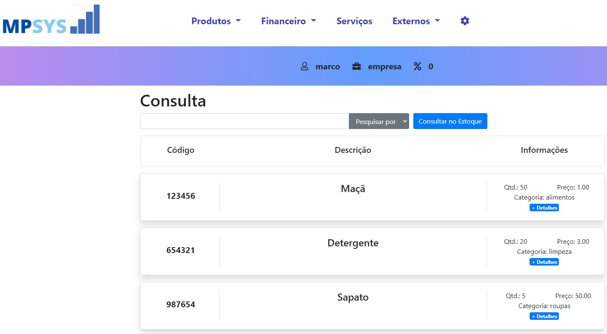

Figura 8 - Consulta de Estoque

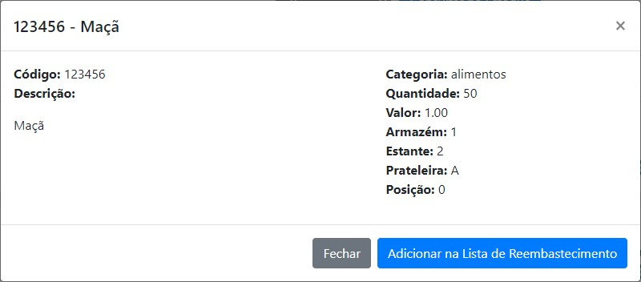

Figura 9 - Detalhes do Produto

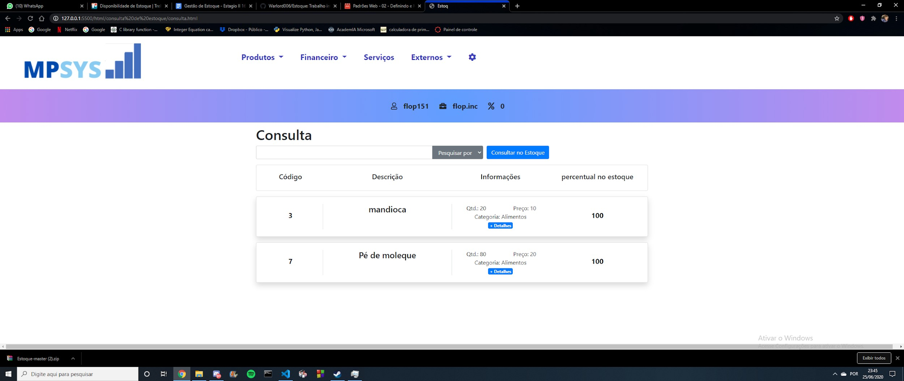

Figura 10 - consulta ao percentual de estoque disponível

```
4.1.10 Tela - Vendas
```

Nesta tela (figura 11), o operador deverá inserir os parâmetros de pesquisa com base na descrição do produto na parte mais abaixo da tela. Os resultados serão exibidos logo abaixo e o usuário deverá clicar na linha do produto que deseja vender. Ao fazê-lo, a caixa com as descrições do material será preenchida com as informações e, a seguir, o usuário deverá informar a quantidade de itens que deseja vender e clicar no botão verde para confirmar a venda.

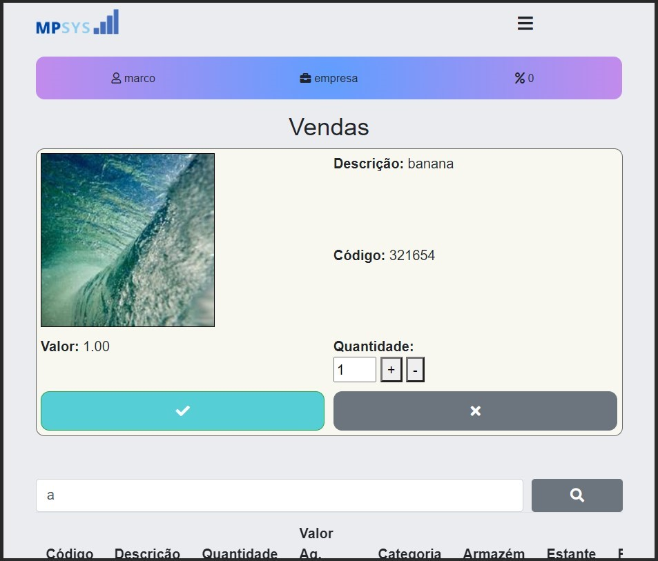

Figura 11 - Tela de Vendas

```
4.1.11 Tela - Compra
```

Nessa funcionalidade, está implementado a seção de Compras. Essa função foi idealizada para que o cliente possa cadastrar compras feitas com distribuidores, que devem ser cadastrados em uma tela que ainda há de ser construída. Por enquanto, é possível cadastrar e excluir uma compra cadastrada. A opção de concluir compra ainda está em desenvolvimento já que ela envolve muitas outras partes e funcionalidades do sistema. Espera-se na próxima entrega estar com ela em mão.

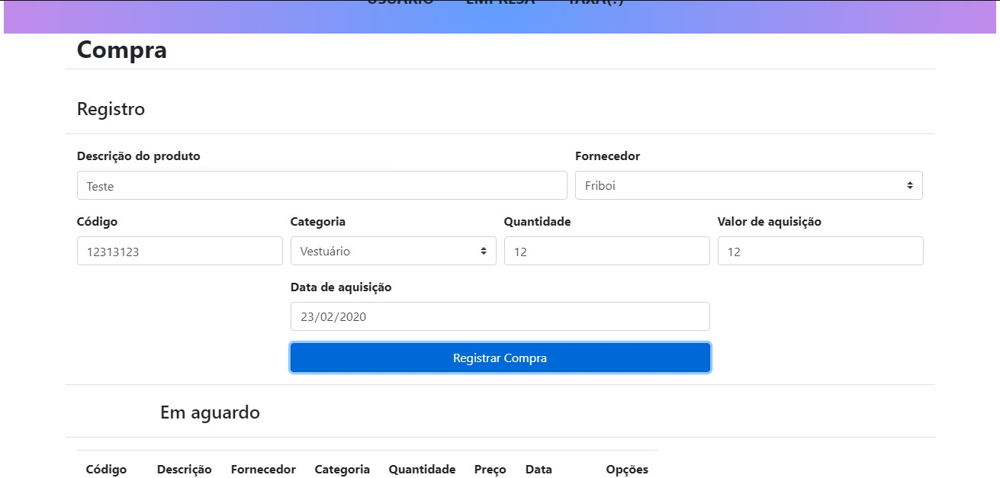

Figura 12 - Tela de Compras

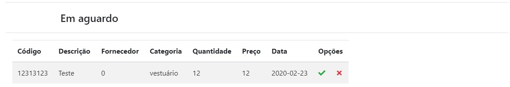

Figura 13 - Tela de Compras - Lista de aguardo

**5. Gerenciamento do Projeto**

A equipe se organiza por meio do manuseamento virtual da ferramenta Kanban disponibilizada na plataforma Trello. Esse instrumento foi selecionado devido a facilidade em utilizá-lo, permitindo fácil visualização do trabalho, consequentemente, auxiliando a otimização do projeto para a data de entrega

Para organização e distribuição das tarefas do projeto, a equipe está utilizando o Trello estruturado com as seguintes listas:

- A fazer;
- Em andamento;
- Teste;
- Concluído; e
- Anotações.

**5. Avaliação**

O processo de realização dos testes da solução desenvolvida está documentado na seção que se segue e traz o plano de testes e, na sequência, o registro dos testes realizados.

```
5.1 Plano de Testes 1 - Entrega Parcial 1
```

Os testes funcionais a serem realizados no aplicativo são descritos na Tabela a seguir.

|Item|Pré Condições e Passo a passo|Resultado Esperado|Resultado Obtido|
|---|---------|----|-----|
|Home-Page| Pré Condições:<br>1. Deve haver conexão de Internet.<br>Passos:<br>1. Abrir o site do sistema|Deve ser exibido a página principal do sistema, com as devidas opções de itens que o usuário tiver acesso. |Resultado obtido dentro do esperado.Obs: Estão funcionando na home-page o botão Entrar e o Cadastre- se agora.|
|Login	|Pré Condições:<br>1.Deve haver conexão de Internet.<br>2.Deve haver um cadastro feito.<br>Passos:<br>1.Abrir o site do sistema. <br>2.Clicar no ícone “Entrar”.<br>3.Digitar o e-mail e a senha.<br>4.  Clicar na caixa escrito “Entrar”.	| Se o e-mail e a senha estiver certa, deve entrar na página do usuário. Caso estiver errado, gera a mensagem de “Credenciais Inválidas”.	| Resultado obtido dentro do esperado.|
|Cadastro de Pessoa|Pré Condições:<br>1. Deve haver conexão de Internet<br/>2.Não deve haver um cadastro feito.<br/>Passos:<br />1.  Abrir o site do sistema.<br/>2.  Clicar no ícone “Entrar”.<br/>3.  Clicar em “Faça um cadastro agora”.<br/>4.  Preencher os dados pessoais: nome, nome de usuário, e-mail e senha.<br/>5.  Preencher os dados empresariais: empresa e cnpj.<br/>6.  Clicar em “Registrar”.|Se todos os dados estiverem preenchidos corretamente, a pessoa é registrada no sistema. Caso contrário, gera a mensagem: “PREENCHA TODOS OS DADOS ANTES DE CONTINUAR.”	|Resultado obtido dentro do esperado. <br/>Obs: a pessoa é registrada mesmo se colocar um e-mail que não existe, ou um formato de cnpj diferente do padrão. |
|Cadastro de Produtos	|Pré Condições:<br>1.  Deve haver conexão de Internet<br>2.  Deve ter criado uma conta no sistema.<br>3.  Deve estar logado com a conta criada.<br>Passos:<br>1.  Abrir o site do sistema.<br>2.  Clicar no ícone “Entrar”.<br>3.  Efetuar o login com uma conta já cadastrada.<br>4.  Clicar no ícone “Produtos” e em seguida em “Cadastro”.<br>5.  Preencher os dados do produto como descrição, código, categoria, quantidade, valor da aquisição etc.<br>6.  Clicar no ícone “Adicionar ao Estoque”.	|Cria um novo tópico na lista de produtos da empresa, relacionado ao novo produto que entrou no estoque.|Está criando o tópico normalmente porém ao adicionar um produto igual a um já cadastrado, ao invés de adicionar ao tópico já existente, ele está criando um novo.|
|Consulta de Produtos	|Pré Condições:<br>1.  Deve haver conexão de Internet<br>2.  Deve ter criado uma conta no sistema.<br>3.  Deve estar logado com a conta criada.<br>Passos:<br>1.  Abrir o site do sistema.<br>2.  Clicar no ícone “Entrar”.<br>3.  Efetuar o login com uma conta já cadastrada.<br>4.  Clicar no ícone “Produtos” e em seguida em “Consulta”.	|Aparecer a lista de produtos em estoque listados pelo Código, Descrição e Informações.|Resultado obtido dentro do esperado. |
|Consulta de Produtos - pesquisa por descrição	|Pré Condições:<br>1.  Deve haver conexão de Internet<br>2.  Deve ter criado uma conta no sistema.<br>3.  Deve estar logado com a conta criada.<br>Passos:<br>1.  Abrir o site do sistema.<br>2.  Clicar no ícone “Entrar”.<br>3.  Efetuar o login com uma conta já cadastrada.<br>4.  Clicar no ícone “Produtos” e em seguida em “Consulta”.<br>5.  Clicar no ícone “Pesquisar por”<br>6.  Selecionar o item “Descrição”<br>7.  Digitar a descrição do produto e clicar em “Consultar no Estoque”	|Se o produto pesquisado está no estoque, aparece somente o mesmo. Caso contrário, aparece a mensagem: “Ops, ocorreu um erro :(. Verifique se está pesquisando pela coisa certa.Se estiver, o produto não está cadastrado. Cadastre-o clicando aqui.”| Resultado obtido dentro do esperado.|
|Consulta de Produtos - pesquisa por código	|Pré Condições:<br>1.  Deve haver conexão de Internet<br>2.  Deve ter criado uma conta no sistema.<br>3.  Deve estar logado com a conta criada.<br>Passos:<br>1.  Abrir o site do sistema.<br>2.  Clicar no ícone “Entrar”.<br>3.  Efetuar o login com uma conta já cadastrada.<br>4.  Clicar no ícone “Produtos” e em seguida em “Consulta”.<br>5.  Clicar no ícone “Pesquisar por”<br>6.  Selecionar o item “Código”<br>7.  Digitar o código do produto e clicar em “Consultar no Estoque”|Se o produto pesquisado está no estoque, aparece somente o mesmo. Caso contrário, aparece a mensagem: “Ops, ocorreu um erro :(. Verifique se está pesquisando pela coisa certa.Se estiver, o produto não está cadastrado. Cadastre-o clicando aqui.”| Resultado obtido dentro do esperado.|
|Designer da home-page   | Pré Condições:<br>1.  Deve haver conexão de Internet<br>Passos:<br>1.  Abrir o site do sistema.  | Mostrar todos os itens e textos que o usuário tem acesso na Língua portuguesa e com uma boa visualização. | O texto com o título: “Método para pequenas e médias empresas“ está com alguns erros ortográficos e precisa ser colocado um pouco mais abaixo para uma melhor visualização. |
| Redirecionamento para a página inicial da empresa.  | Pré Condições:<br>1.  Deve haver conexão de Internet<br>2.  Deve ter criado uma conta no sistema.<br>3.  Deve estar logado com a conta criada.<br>Passos:<br>1.Abrir o site do sistema.<br>2.  Clicar no ícone “Entrar”.<br>3.  Efetuar o login com uma conta já cadastrada.<br>4.  Clicar na imagem da logo do sistema.|   A qualquer momento que clicar na logo “MPSYS”, é redirecionado para a página “Acesso Rápido” da empresa do usuário.| Resultado obtido dentro do esperado.|
|Redirecionamento para a página de cadastro de produtos| Pré Condições:<br>1.  Deve haver conexão de Internet<br>2.  Deve ter criado uma conta no sistema.<br>3.  Deve estar logado com a conta criada.<br>Passos:<br>1.  Abrir o site do sistema.<br>2.  Clicar no ícone “Entrar”.<br>3.  Efetuar o login com uma conta já cadastrada.<br>4.  Clicar no ícone “Produtos” e em seguida em “Consulta”.<br>5.  Fazer uma pesquisa relacionada a um produto que não existe.  |Deve aparecer a mensagem “Ops, ocorreu um erro :(. Verifique se está pesquisando pela coisa certa.Se estiver, o produto não está cadastrado. Cadastre-o clicando aqui.”, e ao clicar em “aqui.”, deve ser redirecionado para a página de cadastro de produtos. | Resultado obtido dentro do esperado.|


```
5.2 Registros de Testes
```

1. Login: O usuário teve dificuldade para achar a página de login, pois ao invés de clicar no ícone “Entrar”, estava clicando em “Experimente grátis”.
2. Login: O usuário teve dificuldade para efetuar o login, pois estava tentando preencher os dados antes de fazer um cadastro.
3. Cadastro: Ao realizar o cadastro e ser redirecionado de volta para a página de login, o usuário achou que não tinha feito o cadastro.
4. Registro de produtos: O usuário teve dificuldade ao colocar o preço do produto, pois não sabia se era o preço da unidade, ou o preço que pagou em todos que estavam entrando no estoque.
5. Registro de produtos: O usuário teve dificuldades em registrar mais de 1 produto, pois os dados do produto pré-cadastrado não foi apagado ao clicar em “Adicionar ao estoque”.
6. Consulta de produtos: O usuário não teve problemas ao consultar os produtos.
7. Detalhes do produto: O usuário não teve problemas em consultar os detalhes dos produtos.
8. Consulta por categorias: O usuário não teve problemas em consultar os produtos através das categorias.

```
5.3 Plano de Testes 2 - Entrega Parcial 2
```

Após a implementação de mais funcionalidades no site MPSYS,foram efetuados novos testes com a intenção de avaliar a sua qualidade. Foram efetuados os testes de Usabilidade e de Heurística de Nielsen.

Teste - Usabilidade

Para este teste foram entregues a cinco usuários distintos uma lista de tarefas e um formulário para ser respondido após executá-las. Tendo em vista o cenário atual, as pessoas escolhidas efetuaram as tarefas e responderam o questionário sem a supervisão presencial de algum integrante do grupo.

Abaixo, seguem as instruções fornecidas ao usuários:

*Este formulário tem como objetivo avaliar funcionalidades operantes do site MPSYS, através das opiniões de diferentes usuários.*

*Será entregue uma sequência de tarefas que deverão ser realizadas uma após a outra.*

- *O principal deste teste é saber sua opinião e não executar a tarefa em si;*
- *Sua ajuda é fundamental;*
- *O site ainda não possui todas as funcionalidades operando*

*Tarefa 1 –Entrar no site MPSYS através do link https://estoque-ti.herokuapp.com/*

*Tarefa 2 – Navegar pelo site durante 2 minutos para conhecer o ambiente*

*Tarefa 3 - Clicar no botão entrar*

*Tarefa 4 – Clicar em faça seu cadastro agora*

*Tarefa 5 – Cadastrar*

*Tarefa 6 – Entrar com login e senha*

*Tarefa 7 – Cadastrar no mínimo 5 produtos*

*Tarefa 8 – Consultar algum desses produtos*

*Tarefa 9 – Sair da conta*

*Se possível , gravar a tela ao fazer os testes*

*O teste será feito por caixas de seleção, onde estiver a opção outros, inserir observações.*

Registro dos Resultados do teste:

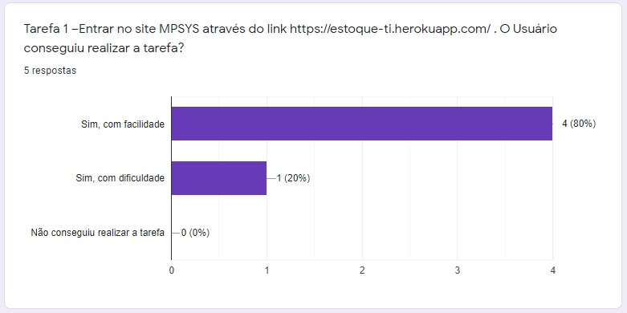


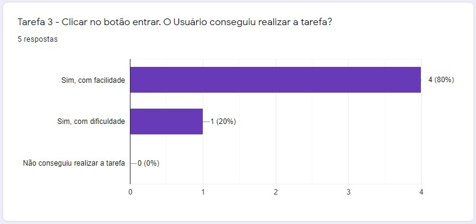

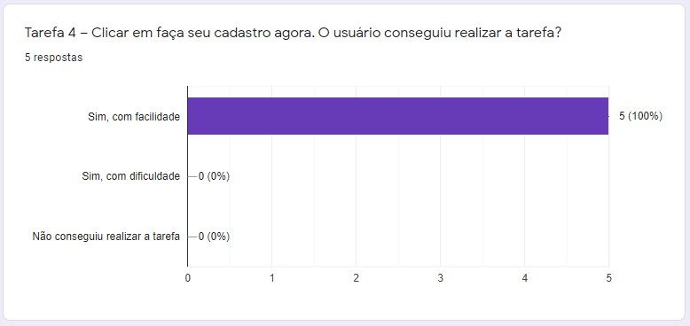

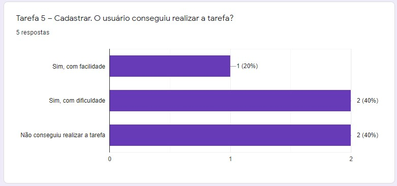

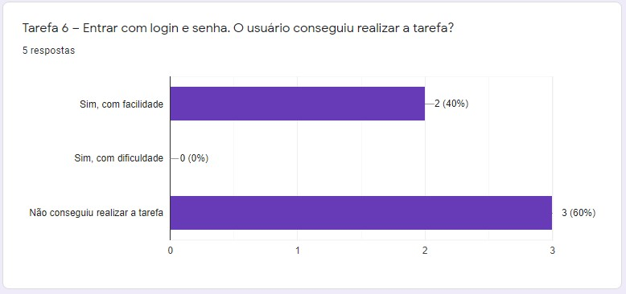

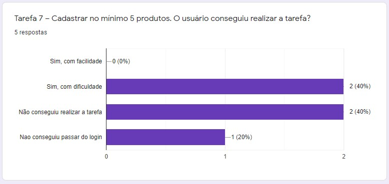

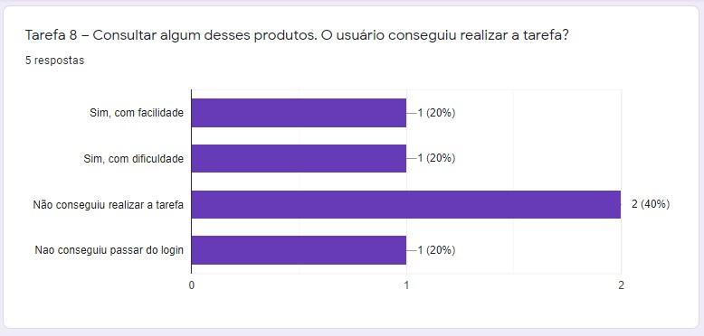

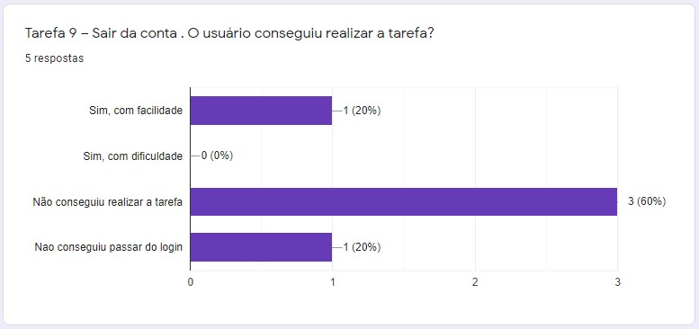

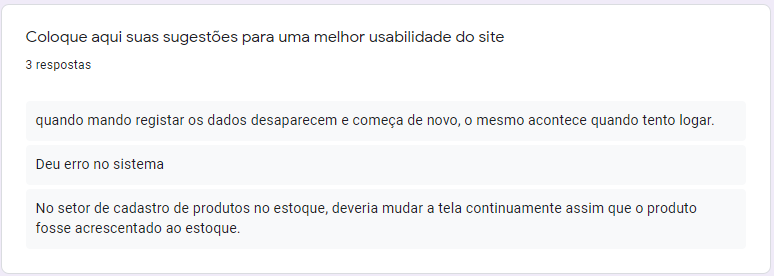

```
5.4 Teste - Heurísticas de Nielsen
```

Método de avaliação de IHC criado para encontrar problemas de usabilidade durante um processo de design iterativo. Rápido e de baixo custo para avaliar IHC, quando comparado aos métodos empíricos, têm como base um conjunto de heurísticas de usabilidade, que descrevem características desejáveis da interação e da interface. Nielsen propõe um conjunto de inicial de 10 heurísticas, que pode ser complementado conforme o avaliador julgar necessário.

1.Os usuários são mantidos informados sobre o progresso do sistema com apropriado feedback em um tempo razoável ?

No cadastro dos produtos, o usuário não recebe uma mensagem avisando que o produto já foi cadastrado. Mas nas demais funcionalidades ele está sempre informado.

2. O sistema utiliza conceitos e linguagem familiar com o usuário em vez de termos orientados ao sistema? O sistema utiliza convenções do mundo real, exibindo informações com uma ordem lógica e natural?

Sim, o software sempre utiliza uma linguagem concreta de fácil entendimento para qualquer nível de conhecimento que o usuário tiver.

3. Os usuários podem fazer o que querem quando querem?

Sim, o usuário tem acesso a todas as funcionalidades do software.

4. O projeto de elementos como objetos e ações têm o mesmo significado ou efeito em diferentes situações?

Na página de cadastro de produtos, o usuário tem dificuldades pois não tem um padrão de preço. O usuário também tem dificuldade em saber se o preço é relacionado a um produto ou relacionado a todos os produtos que entraram.

5. Os elementos de projeto como objetos, ações e opções são possíveis? O usuário é forçado a relembrar informações de uma parte do sistema para outra?

Sim, o nome da empresa, quanto o nome do usuário e os detalhes dos produtos estão sempre visíveis e de fácil acesso.

6. As tarefas de usuário são eficientes e podem se adaptar ao gosto do usuário em suas ações mais freqüentes ou ele utiliza atalhos?

Todas as funcionalidades que já foram implementadas estão familiarizadas com o usuário, ninguém precisaria utilizar atalhos ou algo do tipo.

7. Os diálogos contém informações irrelevantes ou raramente necessárias?

Todas as informações estão claras e diretas, sem informações desnecessárias.

8. Os usuários podem cometer erros dos quais bons projetos poderiam prevenir?

É possível que o usuário pesquise um produto que não existe.

9. As mensagens de erro são expressas em linguagem simples (sem códigos) descrevendo exatamente o problema e sugerindo uma solução?

O erro de o usuário pesquisar um produto que não existe, gera uma mensagem: “Não foram encontrados produtos cadastrados :( Cadastre clicando aqui.”, e lhe dá a opção de cadastrar novos produtos.

10. São fornecidas apropriadas informações de ajuda, e estas informações são fáceis de procurar e de focalizar nas tarefas do usuário?

Sim, o software ajuda o usuário a ser redirecionado a página de cadastro de produtos caso ele esteja tentando pesquisar produtos inexistentes.

```
5.5 Plano de Testes 3- Entrega Parcial 3
```

Este foi realizado após serem acrescentadas novas funcionalidades para uma melhoria no desempenho do site.

|Item|Pré Condições e Passo a passo|Resultado Esperado|Resultado Obtido|
|---|---------|----|-----|
|Home-Page| Pré Condições:<br>1. Deve haver conexão de Internet.<br>Passos:<br>1. Abrir o site do sistema|Deve ser exibido a página principal do sistema, com as devidas opções de itens que o usuário tiver acesso. |Resultado obtido dentro do esperado.|
|Login	|Pré Condições:<br>1.Deve haver conexão de Internet.<br>2.Deve haver um cadastro feito.<br>Passos:<br>1.Abrir o site do sistema. <br>2.Clicar no ícone “Entrar”.<br>3.Digitar o e-mail e a senha.<br>4.  Clicar na caixa escrito “Entrar”.	| Se o e-mail e a senha estiver certa, deve entrar na página do usuário. Caso estiver errado, gera a mensagem de “Credenciais Inválidas”.	| Resultado obtido dentro do esperado.|
|Cadastro de Pessoa|Pré Condições:<br>1. Deve haver conexão de Internet<br/>2.Não deve haver um cadastro feito.<br/>Passos:<br />1.  Abrir o site do sistema.<br/>2.  Clicar no ícone “Entrar”.<br/>3.  Clicar em “Faça um cadastro agora”.<br/>4.  Preencher os dados pessoais: nome, nome de usuário, e-mail e senha.<br/>5.  Preencher os dados empresariais: empresa e cnpj.<br/>6.  Clicar em “Registrar”.|Se todos os dados estiverem preenchidos corretamente, a pessoa é registrada no sistema. Caso contrário, gera a mensagem: “PREENCHA TODOS OS DADOS ANTES DE CONTINUAR.”	|Resultado obtido dentro do esperado. <br/>Obs: a pessoa é registrada mesmo se colocar um e-mail que não existe, ou um formato de cnpj diferente do padrão. |
|Página do usuário | Pré Condições:<br>1.  Deve haver conexão de Internet<br>2.  Deve ter criado uma conta no sistema.<br>3.  Deve estar logado com a conta criada.<br>Passos:<br>1.  Abrir o site do sistema.<br>2.  Clicar no ícone “Entrar”.<br>3.  Digitar o e-mail e a senha..<br>4.  Clicar na caixa escrito "Entrar”.| Deve ser exibido a página com as informações ,e as devidas opções de itens que o usuário tiver acesso. | Resultado obtido dentro do esperado.Obs: estão funcionando os botões, Cadastro, Consulta e Vendas, estes se encontram dentro da opção Produtos.|
|Cadastro de Produtos	|Pré Condições:<br>1.  Deve haver conexão de Internet<br>2.  Deve ter criado uma conta no sistema.<br>3.  Deve estar logado com a conta criada.<br>Passos:<br>1.  Abrir o site do sistema.<br>2.  Clicar no ícone “Entrar”.<br>3.  Efetuar o login com uma conta já cadastrada.<br>4.  Clicar no ícone “Produtos” e em seguida em “Cadastro”.<br>5.  Preencher os dados do produto como descrição, código, categoria, quantidade, valor da aquisição etc.<br>6.  Clicar no ícone “Adicionar ao Estoque”.	|Cria um novo tópico na lista de produtos da empresa, relacionado ao novo produto que entrou no estoque.|Está criando o tópico normalmente Obs: Adicionar um produto igual a um já cadastrado, ao invés de adicionar ao tópico já existente, ele está criando um novo. O Valor de Aquisição não fica claro para o usuário se é unitário ou total.
Pode-se cadastrar produtos diferentes em um mesmo código.|
|Consulta de Produtos	|Pré Condições:<br>1.  Deve haver conexão de Internet<br>2.  Deve ter criado uma conta no sistema.<br>3.  Deve estar logado com a conta criada.<br>Passos:<br>1.  Abrir o site do sistema.<br>2.  Clicar no ícone “Entrar”.<br>3.  Efetuar o login com uma conta já cadastrada.<br>4.  Clicar no ícone “Produtos” e em seguida em “Consulta”.	|Aparecer a lista de produtos em estoque listados pelo Código, Descrição e Informações.|Resultado obtido dentro do esperado. |
|Consulta de Produtos - pesquisa por descrição	|Pré Condições:<br>1.  Deve haver conexão de Internet<br>2.  Deve ter criado uma conta no sistema.<br>3.  Deve estar logado com a conta criada.<br>Passos:<br>1.  Abrir o site do sistema.<br>2.  Clicar no ícone “Entrar”.<br>3.  Efetuar o login com uma conta já cadastrada.<br>4.  Clicar no ícone “Produtos” e em seguida em “Consulta”.<br>5.  Clicar no ícone “Pesquisar por”<br>6.  Selecionar o item “Descrição”<br>7.  Digitar a descrição do produto e clicar em “Consultar no Estoque”	|Se o produto pesquisado está no estoque, aparece somente o mesmo. Caso contrário, aparece a mensagem: “Ops, ocorreu um erro :(. Verifique se está pesquisando pela coisa certa.Se estiver, o produto não está cadastrado. Cadastre-o clicando aqui.”| Resultado obtido dentro do esperado.|
|Consulta de Produtos - pesquisa por código	|Pré Condições:<br>1.  Deve haver conexão de Internet<br>2.  Deve ter criado uma conta no sistema.<br>3.  Deve estar logado com a conta criada.<br>Passos:<br>1.  Abrir o site do sistema.<br>2.  Clicar no ícone “Entrar”.<br>3.  Efetuar o login com uma conta já cadastrada.<br>4.  Clicar no ícone “Produtos” e em seguida em “Consulta”.<br>5.  Clicar no ícone “Pesquisar por”<br>6.  Selecionar o item “Código”<br>7.  Digitar o código do produto e clicar em “Consultar no Estoque”|Se o produto pesquisado está no estoque, aparece somente o mesmo. Caso contrário, aparece a mensagem: “Ops, ocorreu um erro :(. Verifique se está pesquisando pela coisa certa.Se estiver, o produto não está cadastrado. Cadastre-o clicando aqui.”| Resultado obtido dentro do esperado.|
|Designer da home-page   | Pré Condições:<br>1.  Deve haver conexão de Internet<br>Passos:<br>1.  Abrir o site do sistema.  | Mostrar todos os itens e textos que o usuário tem acesso na Língua portuguesa e com uma boa visualização. | Resultado obtido dentro do esperado. |
| Redirecionamento para a página inicial da empresa.  | Pré Condições:<br>1.  Deve haver conexão de Internet<br>2.  Deve ter criado uma conta no sistema.<br>3.  Deve estar logado com a conta criada.<br>Passos:<br>1.Abrir o site do sistema.<br>2.  Clicar no ícone “Entrar”.<br>3.  Efetuar o login com uma conta já cadastrada.<br>4.  Clicar na imagem da logo do sistema.|   A qualquer momento que clicar na logo “MPSYS”, é redirecionado para a página “Acesso Rápido” da empresa do usuário.| Resultado obtido dentro do esperado.|
|Redirecionamento para a página de cadastro de produtos| Pré Condições:<br>1.  Deve haver conexão de Internet<br>2.  Deve ter criado uma conta no sistema.<br>3.  Deve estar logado com a conta criada.<br>Passos:<br>1.  Abrir o site do sistema.<br>2.  Clicar no ícone “Entrar”.<br>3.  Efetuar o login com uma conta já cadastrada.<br>4.  Clicar no ícone “Produtos” e em seguida em “Consulta”.<br>5.  Fazer uma pesquisa relacionada a um produto que não existe.  |Deve aparecer a mensagem “Ops, ocorreu um erro :(. Verifique se está pesquisando pela coisa certa.Se estiver, o produto não está cadastrado. Cadastre-o clicando aqui.”, e ao clicar em “aqui.”, deve ser redirecionado para a página de cadastro de produtos. | Resultado obtido dentro do esperado.|

```
5.6 Análises de Testes
```

Feita á análise entre os testes, e perceptível a evolução tanto no desenvolvimento como no funcionamento do site posterior as modificações abaixo realizadas:

- Home-Page: Ocorreu a adição do funcionamento do botão Cadastre-se.

Obs: É necessário adicionar o funcionamento dos outros botões do menu inicial

- Login: Não ocorreram mudanças na página.
- Cadastro de Pessoa: Após finalizar o cadastro é gerada a mensagem : “Cadastro realizado com sucesso!”

Após tentar realizar o cadastro com um email já existente é gerada a mensagem: “Usuário já cadastrado!”

Obs: a pessoa é registrada mesmo se colocar um e-mail que não existe, ou ainda um formato de email inválido, ou um formato de CNPJ diferente do padrão.

- Página do usuário: Ocorreu a adição da opção de venda, visualização de produtos em estoque e taxas estes se encontram dentro da opção Produtos

Obs: É necessário adicionar o funcionamento dos outros botões do menu inicial

- Cadastro de Produtos: Não ocorreram mudanças na página.

Obs: Adicionar um produto igual a um já cadastrado, ao invés de adicionar ao tópico já existente, ele está criando um novo.

O Valor de Aquisição não fica claro para o usuário se é unitário ou total.

- Consulta de Produtos: Não ocorreram mudanças na página.

